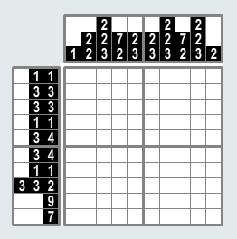
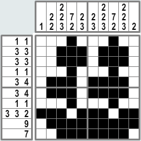

# Grafilogika -- Beadandó feladat -- Webfejlesztés 2. levelező tanári

A feladat egy grafilogika játék megvalósítása lesz. Az egyes feladványokat lehet majd listázni, megoldani, elmenteni, újat létrehozni.
Az alábbiakban a feladatot lépésekre bontom, érdemes ilyen sorrendben elvégezni őket! A JavaScriptet fejleszthetitek lokálisan, majd ezt töltsétek fel Canvasbe. A PHP megoldásokat a webprogramozas.inf.elte.hu szerveren oldjátok meg, ha lehet!

Szeretném kérni, hogy önállóan dolgozzatok, egymásnak kódot ne, legfeljebb ötletet adjatok. Ha ilyen előfordul, akkor forduljatok olyasképpen a segítséget kérőhöz, mintha a diákotok lenne, akinek nem a megoldást mondjátok el, hanem segítséget adtok, hogy rátaláljon a megoldásra. De azért próbáljátok meg önállóan megoldani, és tőlem segítséget kérni.

Feltöltendő a Canvasre a JavaScriptes rész mappája, és a PHP-s fájlok letöltve a szerverről, és egy `README.txt` fájlban a webprogramozas szerveren a megoldás linkje.

## Értékelés

Két jegy születik, egy a JavaScriptre és egy a PHP-ra. Mindkettőből 50 pont szerezhető.

- 0-19: 1
- 20-26: 2
- 27-34: 3
- 35-41: 4
- 42-50: 5

Az egyik feladatrészben szereplő többlet pontok hozzáadódnak a másik feladatrészhez, ha ott önmagában legalább a kettes megvan.

## Érdemjegy

- Kapható, ha a beadandó be van adva
- 1-es, ha valamelyik 1-es
- egyébként a két jegy átlaga

## Grafilogika szabályai

<table>
<tr>
<td>



</td>
<td>



</td>
</tr>
</table>

A grafilogikai játékban a cél egy négyzetrács kiszínezése a sorok és oszlopok mellett megadott számoknak megfelelően. A számok darabszáma a sorok elején és az oszlopok tetején azt jelenti, hogy a sötét négyzetek hány csoportban helyezkednek el. (Például ha az egyik oszlop tetején a 2,3,1,5 számok vanank, ez azt jelzi, hogy abban az oszlopban a sötét négyzetek négy csoportban helyezkednek el.) Maguk a számok azt jelzik, hogy az egyes csoportok hány sötét négyzetet tartalmaznak. (Például az első oszlop tetején levő 2,3,1,5 számok azt jelentik, hogy az első csoportban 2, a következőben 3, majd 1 és végül 5 sötét négyzet van.) Ha helyesen fejted meg a rejtvényt, egy kép rajzolódik ki a rejvényből. Mit ábrázol ez a kép? (<http://www.logikaifeladatok.hu/rejtvenyek.html>)

## A játék megjelenése, működése

A felületen jelenjen meg a kitöltendő négyzetrács és a hozzá kapcsolódó számok a sorok mellett, illetve az oszlopok felett. A celláknak három színezése lehet: a fekete jelzi, hogy ott színezni kell, szürke pont azt jelenti, hogy ott biztosan nem kell színezni, a fehér cella még megoldásra vár. A négyzetrács kezdetben csupa fehér cellából álljon. Egy cellára kattintva először fekete, majd szürke, majd ismét fehér legyen ciklikusan.

## JavaScript

1. (10 pont) Az első lépés, amit meg kell oldanunk, hogy hogyan ábrázoljunk egy grafilogikai feladványt és hogyan jelenítsük azt meg. Egy ilyen feladvány négyzetrácsos, így nekünk is valamilyen ilyen ábrázolási módot kellene használnunk. Az egyik lehetőség, hogy egy többsoros szövegként adjuk meg:

   ```txt
   ..X..
   .X.X.
   X...X
   XXXXX
   X...X
   XXXXX
   ```

   Valahogy így:

   ```js
   let kep = `..X..
   .X.X.
   X...X
   XXXXX
   X...X
   XXXXX`;
   ```

   Ezt a szöveget aztán fel lehet bontani az új sor karakter (`\n`) mentén sorokra (`split()` függvény). Ekkor kapunk egy tömböt, ami szövegekből áll. A szövegek pedig karaketerek sorozatai, amikből ugyancsak a `split` paranccsal karakterek tömbjét kaphatjuk meg, ha az üres szöveggel (`''`) bontjuk fel (`split`). Végeredményként az eredeti szövegünkből előáll egy karaktermátrix.

   Első feladatként tehát készítük el a fenti szövegből a megoldás karaktermátrixát. És írjátok ki a konzolra! A végeredménynek valahogy így kell kinéznie:

   ```js
   let megoldas = kepbolMatrix(kep);
   ```

   ```js
   // megoldas
   [
     [".", ".", "X", ".", "."],
     [".", "X", ".", "X", "."],
     ["X", ".", ".", ".", "X"],
     ["X", "X", "X", "X", "X"],
     ["X", ".", ".", ".", "X"],
     ["X", "X", "X", "X", "X"],
   ];
   ```

2. (5 pont) Mikor előállt a mátrix, akkor meg kellene jeleníteni az oldalon. Egy mátrix legkényelmesebb megjelenítése egy táblázat. Készítsetek egy függvényt, ami paraméterül megkapja a mátrixot és visszatér egy nagy szövegként egy táblázat soraival (`tr`) és benne a cellákkal (`td`). Az így kapott szöveget rakd be dinamikusan egy táblázat (`table`) nyitó és záróeleme közé (`innerHTML`). Ahol a mátrixban `.` volt, oda szürke cellát generáljunk, ahol `X`, oda feketét. Pl.

   ```html
   <table id="tabla">
     <tr>
       <td class="fekete"></td>
     </tr>
   </table>
   ```

3. (10 pont) A következő feladat a megoldás alapján a soronkénti és oszloponkénti blokkok meghatározása, amely információkat a rejtvény bal oldalán és felső részén helyezünk el. Ebben a feladatban készítsük elő az adatszerkezeteket!

   Vegyünk egy sort, és ezen belül határozzuk meg az összefüggő `X` blokkok hosszát. Végeredményként egy tömböt kapunk, amely tartalmazza a hosszakat. Csináljuk ezt meg minden sorra! Az egész megoldást rakjuk egy függvénybe, ami megkap egy mátrixot és visszatér a soronkénti blokkhosszok tömbjével! Írjuk ki a konzolra! Példánkon a végeredmény így néz ki:

   ```js
   let bal = baloldaliBlokkok(megoldas);
   ```

   <!-- prettier-ignore -->
   ```js
   // bal
   [ 
     [ 1 ], 
     [ 1, 1 ], 
     [ 1, 1 ], 
     [ 5 ], 
     [ 1, 1 ], 
     [ 5 ] 
   ]
   ```

   Végezzük el ugyanezt az oszlopokra is (`felso`) és írjuk ki a konzolra!

   ```js
   let felso = felsoBlokkok(megoldas);
   ```

   <!-- prettier-ignore -->
   ```js
   // felso
   [ 
     [ 4 ], 
     [ 1, 1, 1 ], 
     [ 1, 1, 1 ], 
     [ 1, 1, 1 ], 
     [ 4 ]
   ]
   ```

4. (10 pont) A következőként jelenítsük meg az így előállt blokkokat a felületen a táblánk mellett és felett! Van tehát három blokkunk: maga a játéktábla, a bal oldali számok és a felső számok. Egyik lehetőségünk a megjelenítésre, hogy az egész elrendezést betesszük egy 2x2-es táblázatba:

   ```html
   <table id="elrendezes">
     <tr>
       <td><!-- semmi --></td>
       <td><!-- felső --></td>
     </tr>
     <tr>
       <td><!-- bal   --></td>
       <td><!-- tábla --></td>
     </tr>
   </table>
   ```

   A táblát már megjelenítettük korábban, ez most kerüljön bele ide: `<td><!-- tábla --></td>`. A felső és a bal helyére is egy-egy táblázat fog kerülni. A végeredmény így néz ki:

   ```html
   <table id="elrendezes">
     <tr>
       <td><!-- semmi --></td>
       <td>
         <table id="felso"></table>
       </td>
     </tr>
     <tr>
       <td>
         <table id="bal"></table>
       </td>
       <td>
         <table id="tabla"></table>
       </td>
     </tr>
   </table>
   ```

   Innentől nekünk dinamikusan a `felso`, `bal` és `tabla` azonosítójú elemeket kell töltenünk (`innerHTML`). A bal oldali tábla pl. így nézhet ki:

   <!-- prettier-ignore -->
   ```html
   <table id="bal">
     <tr><td>1</td></tr>
     <tr><td>1 1</td></tr>
     <tr><td>1 1</td></tr>
     <tr><td>5</td></tr>
     <tr><td>1 1</td></tr>
     <tr><td>5</td></tr>
   </table>
   ```

   Jelenítsük meg az előkészített bal és felső tömböket a bal és felső táblázatban!

5. (10 pont) Eddig a megoldást jelenítettük meg. A játék azonban üres táblával indul. A megoldás mátrix alapján készítsünk egy ugyanolyan dimenziójú üres mátrixot, és a megoldás helyett azt jelenítsük meg! A táblára kattintva változtassuk a mátrix celláit: első kattintásra fekete, másodikra szürke, harmadikra újból fehér legyen. A mátrix celláiban ennek megfelelő értékeket kell tárolni (pl. 0, 1, 2, de lehet szöveg is).

6. (5 pont) Minden kattintáskor ellenőrizzük le, hogy vége van-e a játéknak. Ehhez össze kell hasonlítani a játékmátrixot és a megoldásmátrixot. Ha minden cella jó, azaz az `X`-es cella helyén fekete cella van, és a `.`-os cella helyén fehér vagy szürke, akkor vége van a játéknak. Ezt írjuk is ki a képernyőre!

7. (+5 pont) Rakjunk egy gombot az oldalra, amelyre kattintva le lehet ellenőrizni, hogy az általunk bejelölt szürke és fekete négyzetrácsok megfelelőek-e. A rossz négyzetrácsok háttere legyen ekkor piros. A fehér cellákról itt nem nyilatkozunk.

8. (+5 pont) Játék közben minden kattintáskor ellenőrizzük, hogy ha egy sorban vagy egy oszlopban a mellettük lévő számoknak megfelelő négyzetcsoportokat elhelyeztük, akkor annak háttere szürkévé válik jelezvén, hogy ott már nem kell ténykednünk. (Nem biztos azonban, hogy helyesen vannak a sorban vagy oszlopban a négyzetek, csak azt tudjuk, hogy megfelelő számban szerepelnek benne.)

9. (+5 pont) Mérjük a játék kezdete óta eltelt időt. Egy órát jelenítsünk meg a felületen, amely mutatja, hogy hány másodperce megy a játék.

## PHP

10. (10 pont) Adatbázisban hozzunk létre egy `feladvanyok` nevű táblát. Ebben tároljuk egy feladvány:

    - azonosítóját (`id`)
    - szélességét
    - magasságát
    - magát a feladványt olyan szövegként, ahogy azt az 1. pontban megadtam (`text` típus)
    - később tárolni kell majd azt is, hogy ki hozta létre (`felhasznalo_id`)

11. (10 pont) Legyen egy főoldal, ahol kilistázzuk az adatbázisban tárolt feladványokat: szélesség, magasság és készítőjének a neve. Technikai segítség: a `feladvanyok` táblában csak a felhasználó azonosítója van. Hogyan tudjuk ehelyett a nevét odarakni? A lekérdezésben ilyenkor két táblát kapcsolunk össze oly módon, hogy a `feladvanyok` tábla egy sorához azt a sort rendeljük a `felhasznalok` táblából, amelynél az azonosítók megegyeznek. A `felhasznalok` táblával a gyakorlaton találkozhattatok, és a 13. pontban definiáljuk.

    ```sql
    SELECT feladvanyok.*, felhasznalok.felhasznalonev FROM feladvanyok, felhasznalok where feladvanyok.felhasznalo_id = felhasznalok.id
    ```

12. (10 pont) A főoldalon egy feladványra kattintva jelenjen meg a játékoldal, ahol lehessen játszani a kiválasztott feladvánnyal. Lépések:

    1. A főoldalon olyan linket generálj egy feladványhoz, amely a játékoldalra mutat és tartalmazza a feladvány azonosítóját: pl. `jatek.php?id=12`
    2. A játékoldalon olvasd ki az `id`-t az URL paraméterek közül, és az adatbázisból kérd le az adott feladványt.
    3. Az oldalon egy külön inline `<script>` tagen belül hozd létre az 1. pontban bemutatott feladványt, és ezt tedd dinamikussá, azaz ide írd azt, amit az adatbázisból megkaptál.
       ```html
       <html>
         <body>
           <!-- ... -->
           <script>
             let kep = `..X..
       .X.X.
       X...X
       XXXXX
       X...X
       XXXXX`;
           </script>
           <script src="jatek.js"></script>
         </body>
       </html>
       ```

13. (10 pont) A játék minden oldala csak regisztrált és bejelentkezett felhasználóknak legyen elérhető. Regisztráció során az email cím és jelszó mellett kérjük be a teljes nevét is az illetőnek. Bejelentkezés email cím és jelszó megadásával történjen! Ehhez létre kell hozni a megfelelő szerkezetű `felhasznalok` táblát. Legyen kijelentkezési lehetőség is.

14. (10 pont) Készítsünk egy olyan, főoldalról elérhető oldalt, amelyen új feladványt tudunk felvenni. Három adatot kell megadnunk:

    - egy többsoros szöveges beviteli mezőbe lehessen beírni egy olyan szöveget, amelyet az 1. pontban definiáltunk
    - legyen egy szélesség és magasság mező, amelybe be lehet írni a feladvány dimenzióit
    - (+3 pont) ez utóbbi két mező legyen csak olvasható, és az információkat JavaScript segítségével töltsük bele a textarea tartalma alapján. Ugyanitt ellenőrizzük azt is, hogy a beírt szöveg minden sora ugyanolyan hosszú-e!

    Egy mentés gombra kattintva ellenőrizzük a szerveroldalon, hogy minden mező ki van-e töltve helyesen. Ha nem, akkor írjuk ki a megfelelő hibaüzeneteket. Ha igen, akkor mentsük el a feladványt a bejelentkezett felhasználó azonosítójával együtt a `feladvanyok` táblába.

15. (+5 pont) Játék közben lehessen elmenteni az aktuális állapotot. Ehhez kell egy új `mentesek` tábla:

    - `id`
    - `felhasznalo_id`: ki mentette
    - `feladvany_id`: melyik feladványt mentette
    - mentett állapot szövegként úgy, mint a `feladvanyok` táblában

    A mentés egy gombra történjen meg, az alábbi lépések szerint

    - A mentés gomb egy űrlapban van, amiben van egy rejtett mező is
    - Az űrlap elküldésekor (`submit` esemény) kell még egy kis logika
    - JavaScripttel ki kell olvasni a játéktábla aktuális állapotát, és abból egy olyan szöveget létrehozni, mint a feladványé: `.X..X`, stb. Ezt a szöveget kell a rejtett mező értékének adni. Így ez is elküldésre kerül az űrlappal
    - Szerver oldalon az URL-ben jön a feladány azonosítója, ismerjük a bejelentkezett felhasznaló azonosítóját, a POST-olt adatok közül kiolvassuk a mentendő állapotot, és ezt elmentjük a `mentesek` táblába.
    - Átirányítás a főoldalra.

16. (+2 pont) A főoldalon legyen egy lista a bejelentkezett felhasználó mentéseivel.

17. (+5 pont) Egy mentésre kattintva töltsük be a játékoldalt, és folytathassuk a játékot!
